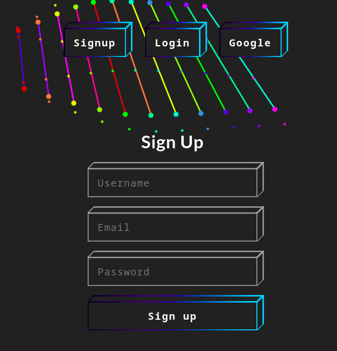
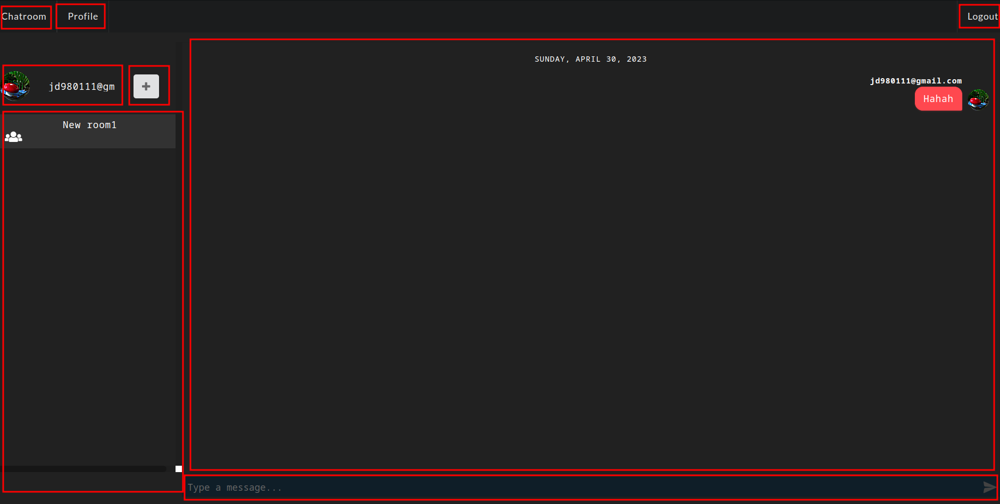
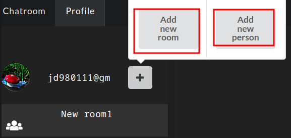
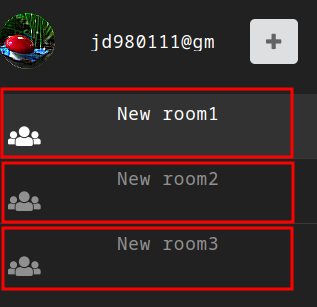

# Chatroom 

## Basic usage

### Signin
- Signup with email
- Signin with email or google


### Chatroom



- Add person or room



- Click to choose rooms



---

## Setup

### Add index.html 
- Add index.html with following in public directory
```html
<!DOCTYPE html>
<html lang="en">

<head>
    <meta charset="UTF-8">
    <meta http-equiv="X-UA-Compatible" content="IE=edge">
    <meta name="viewport" content="width=device-width, initial-scale=1.0">
    <title>Chatroom</title>
</head>

<body>
    <div id="root"></div>
</body>

</html>
```
### Setup firebase

```bash
firebase deploy
```

- Site : [https://software-studio-chatroom-59f2f.web.app](https://software-studio-chatroom-59f2f.web.app)

### Database rules
```json
{
  "rules": {
    "com_list": {
      "rooms": {
        ".write": "auth.uid != null",
        ".read": "auth.uid != null"
      },
      "userlength": {
        ".write": true,
        ".read": true
      },
      "users": {
        ".write": false,
        ".read": false,
        "$userid": {
          ".read": "$userid === auth.uid",
          ".write": "$userid === auth.uid"
        }
      }
    }
  }
}
```